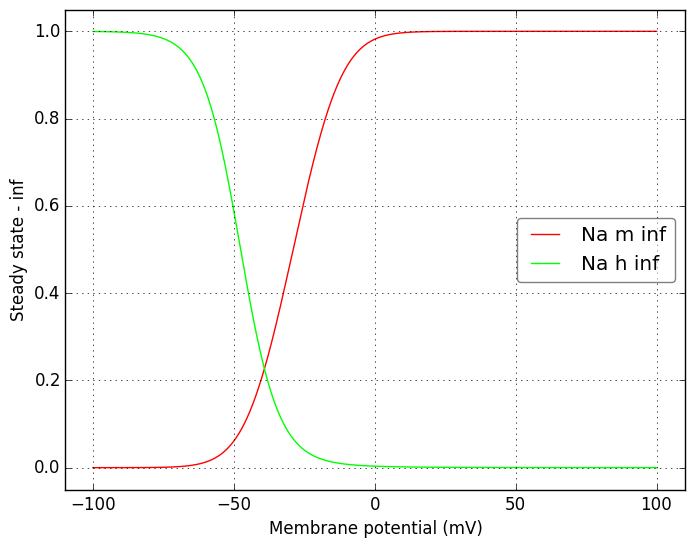
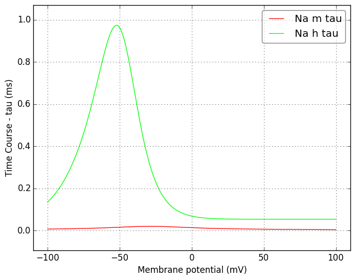
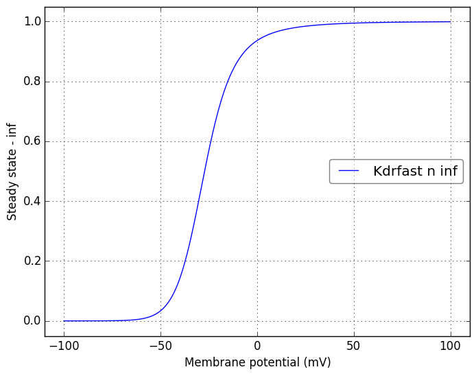
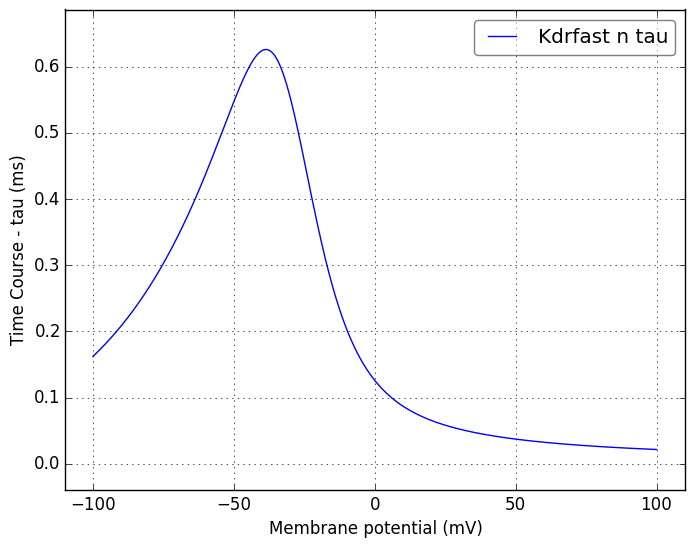

Channel information
===================
    

Channel information at: T = 22.0 degC, E_rev = 0 mV, [Ca2+] = 5e-05 mM

<table>
    <tr>
<td width="120px">
            <b>Na</b> 
            <a href="../Na.channel.nml">Na.channel.nml</a> 
            <b>Ion: na</b> 
            <i>g = gmax * m3 * h </i> 
            Na+ channel description (modeld by Migliore)
</td>
<td>

</td>
<td>

</td>
</tr>
    <tr>
<td width="120px">
            <b>Kdrfast</b> 
            <a href="../Kdrfast.channel.nml">Kdrfast.channel.nml</a> 
            <b>Ion: k</b> 
            <i>g = gmax * n4 </i> 
            Fast inactivating delayed rectifier K+ channel description (modeld by Migliore)
</td>
<td>

</td>
<td>

</td>
</tr>
</table>

